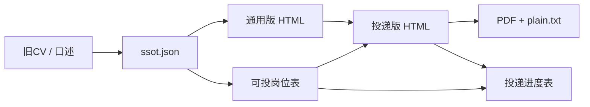

# Agent 路由（唯一权威）

> 设计立场 → [DESIGN.md](DESIGN.md)

## 最小日路径

空仓 / 首次 → 聊经历（walkthrough）→ **通用版 HTML**。  
有通用版 + JD → 投递版。搜可投 / 进度表 / 面试 / 开场 → **按需**再开对应流程。

## 三条 invariant

1. 事实只进 `ssot.json`；JD 包装只进 HTML  
2. 术语走 `term_registry`；`internal` 不上简历；`essential` 保留 ATS 关键词  
3. 争议 → `conflicts`；裁决 → `constraints`；再动简历  

## 数据流



## 工作区（磁盘布局，不对用户报文件名）

```
<workspace>/
├── ssot.json
├── resumes/
│   ├── industry_base.html
│   ├── industry_<jd-slug>.html
│   ├── industry_<jd-slug>.txt
│   ├── academic_base.html
│   ├── academic_<jd-slug>.html
│   └── academic_<jd-slug>.txt
├── offers/                          # 可选：求职漏斗
│   ├── job-match-industry.html      # 可投岗位表（多渠道实搜+审计）
│   ├── application-tracker.html     # 投递进度表
│   ├── candidate-profile.json       # 求职画像（技能/偏好；扩岗前默认更新）
│   └── _scratch/                    # 临时检索；勿对用户堆路径
└── config.json   # 可选，templates/config.example.json
```

对用户称：**经历档案 / 通用版 / 投递版 / 网申文本 / 可投岗位表 / 投递进度表 / 面试准备**。

## 智能默认

| 信号 | 动作 |
|------|------|
| 首次、工作区空 | 自动复制 starter → 建 `resumes/` |
| 给了旧简历路径 | scan → 若要 JD 则直接 jd（lazy base） |
| 只口述 | walkthrough，3 轮，第 1 轮后出草稿 |
| 新缩写 ≤5 | 内联翻译，跳过 audit-terms |
| 投递版交付 | HTML + 尝试 PDF + `export_plain.py --from-html`；短审计 + 必答追问；有 offers/ 则联动进度表 |
| 只改一句 | [workflows/patch.md](workflows/patch.md)：改 HTML → 最小 ssot 回写 → validate |
| 学术版简历 | `academic` 轨 + `templates/resume-academic.html` |
| 搜可投岗位 / 刷新岗位表 | [workflows/candidate-profile.md](workflows/candidate-profile.md)（步骤 0 默认刷新）→ [workflows/job-match.md](workflows/job-match.md)：脑暴 → 多渠道实搜 → 审计入库 |
| 搜可投 + 本机已配置 boss-agent MCP | [workflows/job-match.md](workflows/job-match.md) 步骤 2：Boss/智联优先 CLI `search`/`detail`；猎聘等降级浏览器 |
| 总结技能/求职偏好 / 适合投什么 | [workflows/candidate-profile.md](workflows/candidate-profile.md) |
| 无岗位表 | 从 `templates/job-match-board.html` 复制到 `offers/` |
| 同步可投表 / 发来 job-match-state.json | [workflows/job-match.md](workflows/job-match.md)「Agent 同步可投表」 |
| 更新投递 / Offer / 进度表 | [workflows/offer.md](workflows/offer.md) |
| 无进度表 | 从 `templates/application-tracker.html` 复制到 `offers/` |
| 岗位定位 / 要点改写 / HR 开场（不要文件） | [workflows/resume.md](workflows/resume.md) Mode · pitch + [rules/resume.md](rules/resume.md) |
| 面试预测 / 追问 / 掌握度 | [workflows/interview.md](workflows/interview.md) |
| 用户焦虑 | [README.md](../README.md) FAQ；≤3 问/轮 |

**禁止**：要求用户读 agent 文档；一次丢 >3 路径；对用户说 workflow/schema 名、SSOT、audit、subagent。

## 何时读 references（默认不读）

| 条件 | 读 |
|------|-----|
| 商业分析 / 经营分析 / WFM / 增长类经历 | [references/business-analysis-evidence.md](references/business-analysis-evidence.md) |
| 跨会话强主张 / 多岗版本共用基线 | [references/claim-evidence-ledger.md](references/claim-evidence-ledger.md) |
| 用户要邮箱巡检进度 | [references/email-monitoring.md](references/email-monitoring.md) |

## 模式路由

| 意图 | 文档 |
|------|------|
| 新建 | [workflows/init.md](workflows/init.md) + [schema/ssot.md](schema/ssot.md) |
| 改事实 | [workflows/maintain.md](workflows/maintain.md) + [rules/core.md](rules/core.md) |
| 出简历 / 定位开场 / 要点包装 | [workflows/resume.md](workflows/resume.md) + [rules/resume.md](rules/resume.md) |
| 轻量编辑 | [workflows/patch.md](workflows/patch.md) + [rules/resume.md](rules/resume.md) |
| 总结技能/求职偏好 | [workflows/candidate-profile.md](workflows/candidate-profile.md) |
| 搜可投岗位 | [workflows/candidate-profile.md](workflows/candidate-profile.md) + [workflows/job-match.md](workflows/job-match.md) |
| 投递进度 / Offer | [workflows/offer.md](workflows/offer.md) |
| 面试准备 | [workflows/interview.md](workflows/interview.md) |
| 从 GitHub 安装 | [INSTALL.md](INSTALL.md) |
| PDF / ATS | [scripts/README.md](../scripts/README.md) |

## 输出

- 自然语言短报；选材表用人话  
- jd 版：[HR 自检](rules/resume.md#hr-自检) + 短审计 + 必答追问 2–3  
- 排版/叙事对照（公开虚构）：[fixtures/example-ssot.json](../fixtures/example-ssot.json) + [example-resume.html](../fixtures/example-resume.html)
- 作者本机私人定稿对照放在**求职工作区**私有目录（如 `_private/`）；**包内不引用、不索取上传**

## 校验命令

```bash
python scripts/validate_ssot.py <ssot.json>
python scripts/render_resume.py --in <html> [--preview-dir <dir>]
python scripts/export_plain.py --from-html resumes/<slug>.html --in ssot.json --out resumes/<slug>.txt
python tests/test_scripts.py
```
